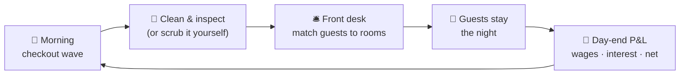

# Old Town Hotel 🏨

**A cozy, retro hotel-management sim built solo in Unity 6 — take over a run-down old-town hotel, inherit its $183,000 debt, and clean, staff, and renovate your way back to glory.**


<sub>Solo portfolio project by **Percy Wu**. The mechanics are real hotel-operations domain knowledge — front desk, housekeeping, room turnover, RevPAR-style economics — turned into a warm, fun-first management game. See the [changelog](CHANGELOG.md) for development history.</sub>

| Front Desk | Rooms | The Lounge |
|:---:|:---:|:---:|
|  |  |  |

---

## 🎮 The game

You've just taken over a faded old-town hotel — and its **$183,000 of inherited debt**. Interest bleeds daily. Every in-game day runs on a real hotel's rhythm:



- **Mornings start with checkouts.** Last night's guests leave one by one, each settling their bill — and each leaving a dirty room. Housekeeping's day begins at checkout.
- **Read your guests.** Business, family, and VIP guests arrive with bed-type needs and preferences (high floor, quiet side). Match them well and they pay a premium at checkout; disappoint them and they pay less — and your ★ reputation feels it.
- **Money is the pressure.** Wages settle daily, interest compounds on the debt, and revenue only lands when a guest checks out. The day-end ledger tells you whether you're climbing out of the hole or digging it deeper.
- **Headcount is the decision.** Hire a second housekeeper and a real second worker walks in (signing costs and daily wages included) — or save the money and scrub the rooms yourself at half speed. Understaffed, *you* are the bottleneck.
- **Invest to escape.** Renovate rooms (Old → Basic → Better) to raise nightly rates and hotel valuation — which in turn raises your credit line at the bank.

## ✨ Systems

| System | What it does |
|---|---|
| **Day cycle** | Overnight stays, staggered morning checkout wave, three-phase day, day-end P&L with wages & loan interest |
| **Front desk** | Live incoming-guest queue, guest preferences & patience, manual room assignment with suitability ranking |
| **Rooms** | Per-room state machine (*dirty → cleaning → inspection → ready / occupied / blocked*) with color-coded state badges |
| **Staffing** | Payroll-driven worker instances (hire = a real pair of hands), attributes / traits / morale, raises & firing, boss "Do It Yourself" cover |
| **Economy** | Inherited debt with daily interest, hotel valuation & value-backed credit line, tiered nightly revenue × stay quality, rolling ★ reputation |
| **Renovation** | Per-room tier upgrades with cost, build time & batch discounts; feeds room rates and valuation |
| **The Lounge** | Café side-loop: serve drinks, manage cup & ingredient stock, run the dishwasher |
| **Persistence** | Single-slot JSON autosave of economy progression at day end |

## 🏗️ Engineering

- **Test-first economy** — the entire money model (payroll, loans, valuation, staff, renovation, reputation, checkout revenue) is pure C# behind MonoBehaviour facades, covered by **137 EditMode tests** written red-green-refactor.
- **Data-driven balance** — every tunable lives in `ScriptableObject` configs (economy constants, renovation tiers, staff archetypes, room balance) and is registered in a design-side tuning-knobs ledger. Balancing never touches code.
- **Decisions on record** — an ADR set documents every architectural call, including the deliberate evolution from a hard single-worker bottleneck (ADR 0004) to a payroll-driven multi-staff economy (ADR 0008).
- **Event-driven UI** — a reusable modal system and screen controllers that *bind* to gameplay state (`OnDaySettled`, payroll roster events) rather than own it; view and simulation stay separable.
- **Explicit state machines** — room day-cycle and worker states are enums with guarded transitions, not scattered booleans.
- **AI-assisted workflow** — built with Claude Code driving the Unity Editor over MCP: scene wiring, prefab surgery, play-mode verification loops, and TDD runs are all scripted conversations with the editor. Human taste, machine hands.

## 📂 Project layout

```
Assets/Game/         Scripts (gameplay · economy · UI), Prefabs, Scenes, ScriptableObjects
Assets/Tests/        EditMode unit tests (economy, staffing, renovation, save, reputation)
Assets/Screenshots/  Captured screens
CHANGELOG.md         Development history, newest first
```

> Design docs (GDD, ADRs, balance sheets) live in a private companion repo — happy to walk through them on request.

## ▶️ Running it

1. Open the project in **Unity 6 (6000.3.x or newer)**.
2. Open `Assets/Game/Scenes/Hotel_Rooms_2D_Proto.unity` and press **Play** — the hotel opens for business automatically.

## 🗺️ Roadmap

- **Juice pass** — audio, tweened UI, coin-flight money feedback, receipt-style day-end printing
- **Reputation → guest volume** — ★ score driving daily arrivals (the loop's foundation is in)
- **Staff personality in play** — traits with visible consequences (the clumsy cheap hire, the brilliant one who keeps demanding raises)
- **Candidate cards** — hiring pool UI with flip-to-reveal candidates
- **Win condition** — clear the debt, renovate every room, and reopen the grand old hotel

## 👤 About the developer

**Percy Wu** — game developer & software engineer with commercial mobile-game experience at **Tencent Games** and **Bilibili** (C++ / Unreal / Lua), now building in Unity / C#, plus full-stack and AI-assisted tooling.

- GitHub: [github.com/wsq94317](https://github.com/wsq94317)
- LinkedIn: [linkedin.com/in/siqi-wu-percy](https://www.linkedin.com/in/siqi-wu-percy)

<sub>Personal work-in-progress project shared as a portfolio piece. Code walkthrough and playable build available on request.</sub>
